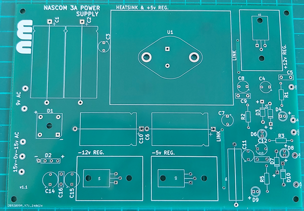
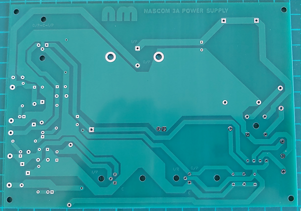
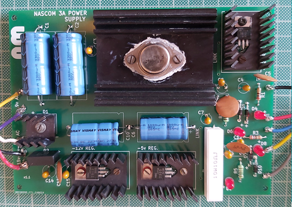

# Nascom 3A PSU

Nascom 3A PSU replica

## Introduction

This board is a form, fit and function replacement for the original Nascom 3A PSU.
Many of these boards are now showing their age and this is the perfect replacement for those wanting the original hardware.

Kicad View

Front PCB

Back PCB

Built PCB

